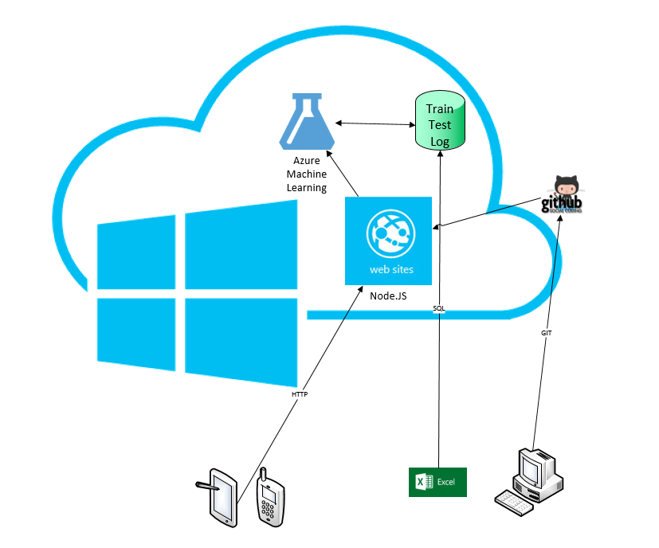
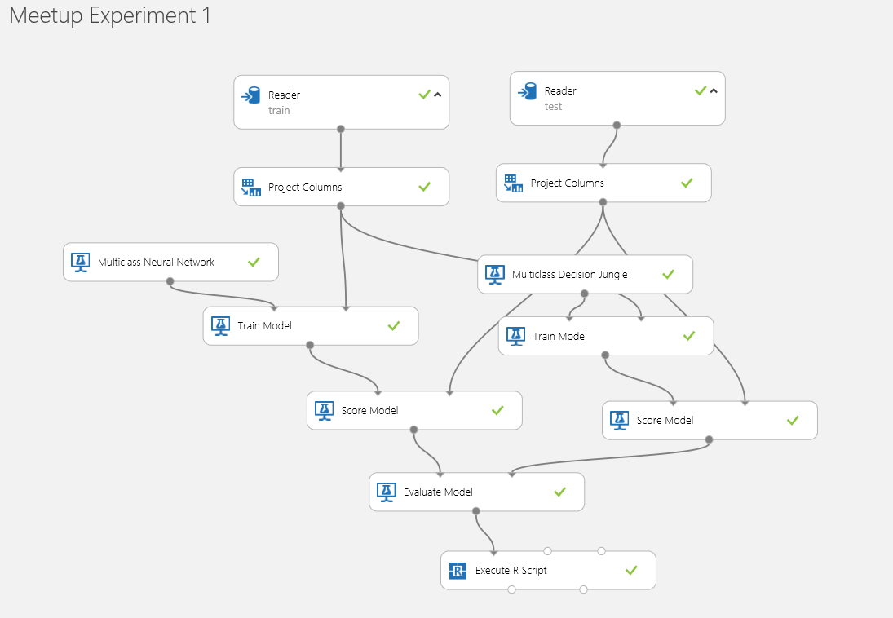
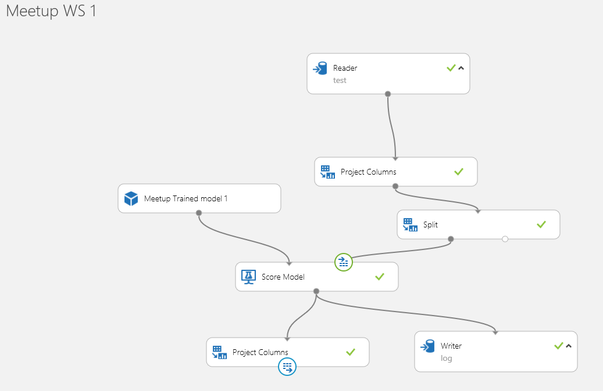

## Microsoft Azure Machine Learning kliens példa
A csomag egy Node.js példa webalkalmazást tartalmaz, ami Microsoft Azure Machine Learning segítségével kézírást ismer fel. Az előadás 2014. december 10-én hangzott el a [LogMeIn-Microsoft Enterprise Developer Meetup](http://www.meetup.com/Enterprise-Developer-Meetup/events/218821916/)-on, a 
címe [Gépi Tanulás a felhőben, avagy "Mit adtak nekünk a Statisztikusok?"](https://sway.com/egma-XKs8dKS9nyj)

A [Webalkalmazás](http://aka.ms/meetupml) kipróbálható élőben is.

#### Az architektúra

#### Machine Learning modell kialakítása
[Training és teszt adatok letöltése](https://archive.ics.uci.edu/ml/datasets/
Optical+Recognition+of+Handwritten+Digits)

###### Azure ML Experiment 

###### Azure ML Web service

#### Futtatás
* git clone https://github.com/ViktorDudas/meetupml.git
* cd meetupml
* npm install
* node bin/www
* <http://localhost:3000>

#### Hasznos Linkek

* [scikit-learn algorithm cheat-sheet](http://scikit-learn.org/stable/tutorial/machine_learning_map/)

* [Machine Learning prezi](https://prezi.com/06swcwazd0ai/machine-learning/)

* [Building Web Apps on the MEAN Stack with OData in Microsoft Azure](http://msdn.microsoft.com/en-us/magazine/dn857363.aspx)

